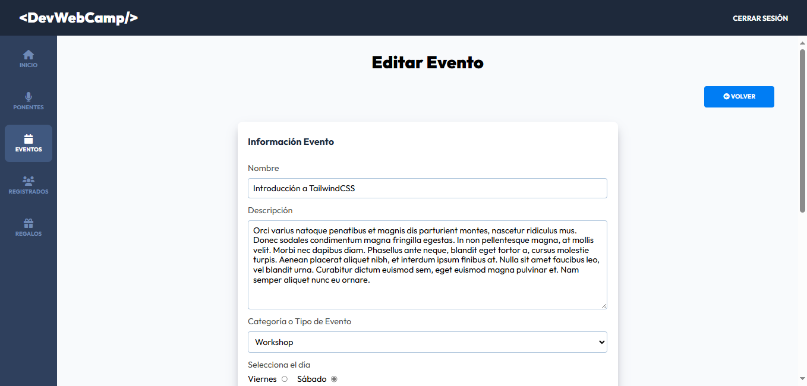

# </>💻🚀 DevWebCamp

**DevWebCamp** es una plataforma web completa para la **gestión integral de un evento de conferencias y workshops para desarrolladores**. Su propósito es facilitar tanto la **divulgación del evento** como la **organización logística y administrativa**, ofreciendo una experiencia moderna y eficiente para los asistentes y para el equipo organizador.

Este proyecto fue desarrollado como parte de mi formación en desarrollo web full stack, aplicando principios sólidos de **programación backend con PHP**, **arquitectura MVC**, **seguridad**, e integración con bases de datos y pagos en línea.
---

## 📖 Descripción  

DevWebCamp ofrece una **experiencia completa** para dos tipos de usuarios:

- **Asistentes**: pueden explorar el evento, elegir entre planes (gratuito, virtual o presencial), registrarse, seleccionar conferencias y regalos, y obtener su **boleto virtual personalizado**.
- **Administradores**: acceden a un panel de gestión donde pueden supervisar cada aspecto del evento, desde el dashboard con estadísticas clave hasta la creación y edición de ponentes, conferencias, workshops y más.

Se trata de una **plataforma robusta**, pensada para cubrir todos los frentes necesarios en un evento tecnológico real.

---

### ⚙️ Características principales

- 🔐 **Autenticación segura**: Registro, inicio de sesión, recuperación de contraseña y protección de rutas según el rol del usuario.
- 🧾 **Planes de asistencia**: Registro a planes gratuito, virtual o presencial, cada uno con diferentes privilegios y costos.
- 💳 **Pagos integrados con PayPal**: Los usuarios pueden completar su compra de manera segura y automática.
- 🎟️ **Generación de boletos virtuales**: Diseño dinámico del boleto según el plan adquirido, con código QR único.
- 🧑‍💼 **Gestión de usuarios**: Área de perfil con edición de datos personales y contraseña con validación en tiempo real.
- 📋 **Selección interactiva de conferencias y regalos**: Vista intuitiva y dinámica que respeta horarios y disponibilidad.
- 📊 **Dashboard administrativo**: Resumen en tiempo real de registros, ingresos, estadísticas de asistencia y regalos.
- 🧑‍🏫 **CRUD de ponentes, conferencias y workshops**: Herramientas completas para crear, editar y eliminar contenido del evento.
- 🧩 **Arquitectura MVC**: Código estructurado para facilitar el mantenimiento y la escalabilidad.

---

## 🔐 Seguridad y buenas prácticas

- Validaciones en el cliente (JS) y en el servidor (PHP) para prevenir datos inválidos.
- Hashing de contraseñas y manejo seguro de sesiones.
- Rutas protegidas por tipo de usuario (admin o asistente).
- Separación clara de responsabilidades con patrones MVC y controladores dedicados.

---

## 🛠 Tecnologías Usadas  

- 🟢 **PHP** - Lógica del servidor y procesamiento de formularios.
- 🗄 **MySQL** - Base de datos relacional.
- 🌐 **JavaScript** - Interactividad y validaciones en frontend.
- 📄 **HTML** - Estructura de las páginas.
- 🎨 **CSS + SASS** - Estilos modernos y organizados.
- 🛠 **Node.js (Gulp)** - Automatización de tareas (compilación de SASS y optimización de assets).

---

## 📸 Imágenes del Proyecto

Puedes ver más imagenes [aquí](https://github.com/Gatumbac/DevWebCamp/tree/main/assets).

---

## 👨‍💻 Autor  
Desarrollado por **[Gatumbac](https://github.com/Gatumbac)**  
📧 Contacto: gatumbac@espol.edu.ec 
📌 LinkedIn: [Gabriel Tumbaco](https://www.linkedin.com/in/gabriel-tumbaco-santana/)  

---

¡Gracias por visitar el repositorio! Siéntete libre de dar ⭐️ o enviar sugerencias 😊

